# Simulation Results

This directory contains the results and visualizations from the simulation of PRoPHET routing protocol with different buffer management techniques.

## Performance Metrics

The following metrics were used to evaluate the performance of each buffer management technique:

1. **Delivery Probability**: The ratio of successfully delivered messages to the total number of created messages.
   - Higher values indicate better performance
   - Formula: `Delivery Probability = Number of Delivered Messages / Number of Created Messages`

2. **Overhead Ratio**: The transmission cost in terms of extra message replications needed for each delivered message.
   - Lower values indicate better efficiency
   - Formula: `Overhead Ratio = (Number of Relayed Messages - Number of Delivered Messages) / Number of Delivered Messages`

3. **Hop Count Average**: The average number of intermediate nodes that messages pass through before reaching their destination.
   - Lower values generally indicate more efficient routing
   - Formula: `Hop Count Average = Total Hop Count / Number of Delivered Messages`

4. **Latency Average**: The average time (in seconds) between message creation and successful delivery.
   - Lower values indicate faster delivery
   - Formula: `Latency Average = Total Latency / Number of Delivered Messages`

## Visualizations

### Delivery Probability

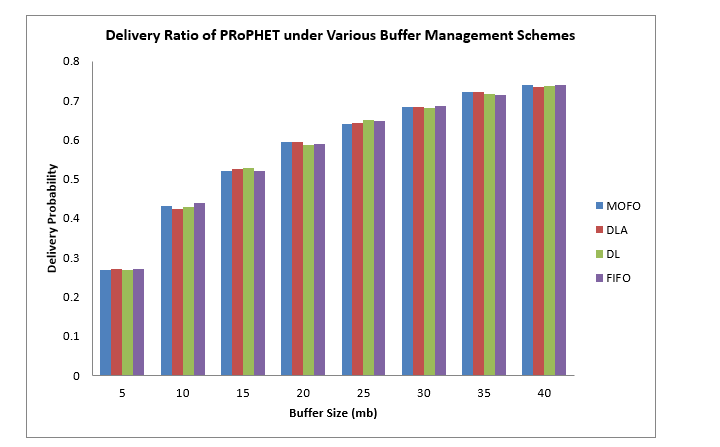

This graph shows how the delivery probability increases as buffer size increases for all four buffer management techniques. At larger buffer sizes (35-40MB), MOFO slightly outperforms the other techniques, achieving a delivery probability of approximately 0.74 at 40MB buffer size.

### Overhead Ratio

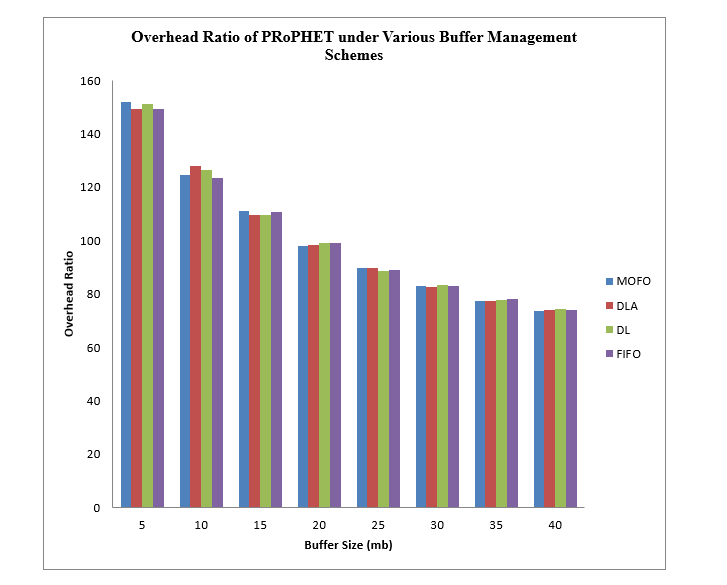

This graph illustrates how the overhead ratio decreases significantly as buffer size increases. The difference between techniques is most noticeable at smaller buffer sizes, with all techniques converging at larger buffer sizes. At 40MB, MOFO achieves the lowest overhead ratio at approximately 73.79.

### Hop Count Average

This graph shows how the hop count average decreases as buffer size increases, indicating more efficient routing paths with larger buffers. At 40MB buffer size, DLA achieves the lowest hop count average at approximately 3.08.

### Latency Average

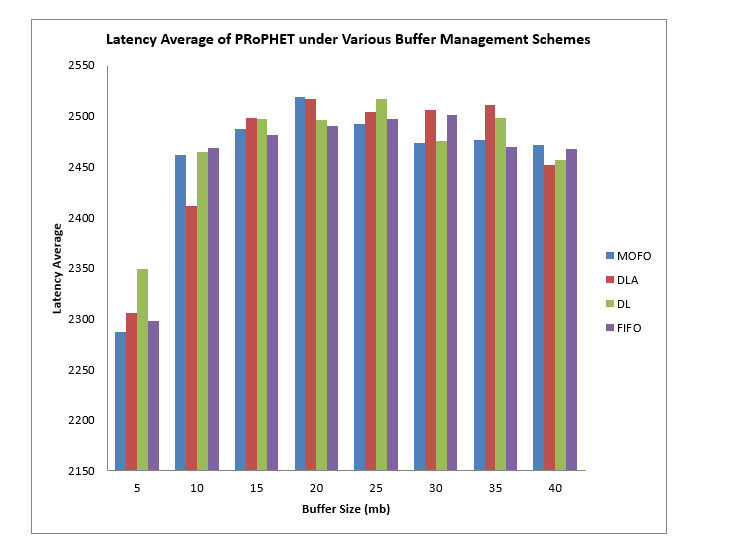

This graph shows how the latency average changes with buffer size. Unlike the other metrics, latency average generally increases with buffer size up to 20-25MB and then begins to decrease. At 40MB, DLA achieves the lowest latency average at approximately 2451 seconds.

## Tabulated Results

The following tables present the detailed numerical results for each buffer management technique at different buffer sizes:

### 5MB Buffer Size
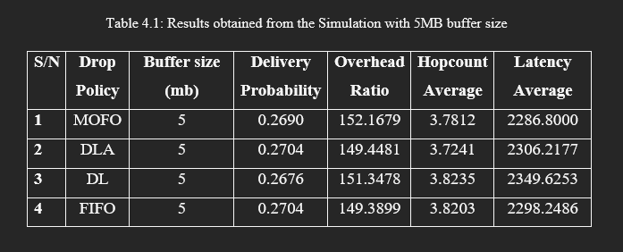

### 10MB Buffer Size
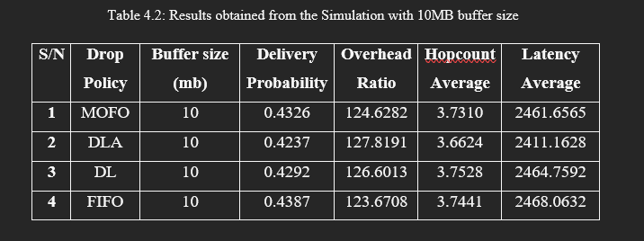

### 15MB Buffer Size
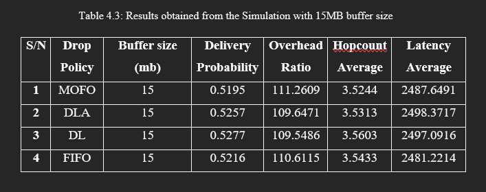

### 20MB Buffer Size
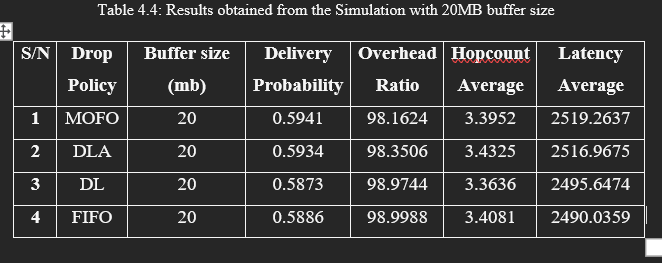

### 25MB Buffer Size
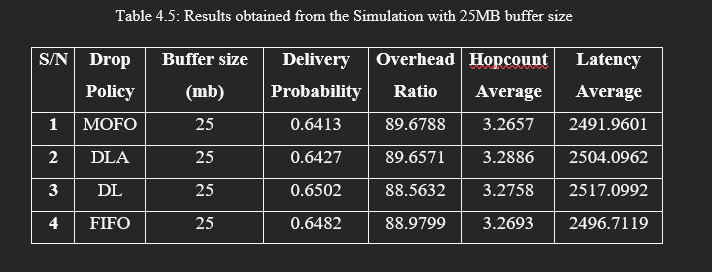

### 30MB Buffer Size
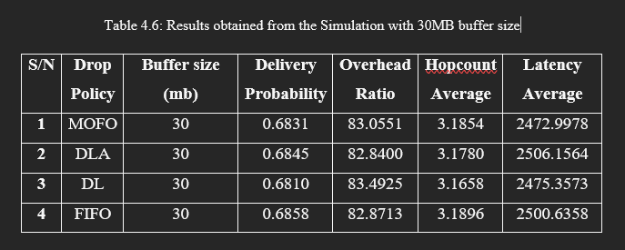

### 35MB Buffer Size
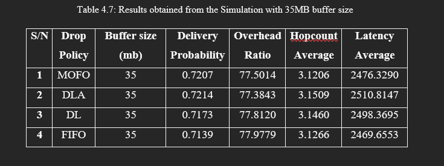

### 40MB Buffer Size
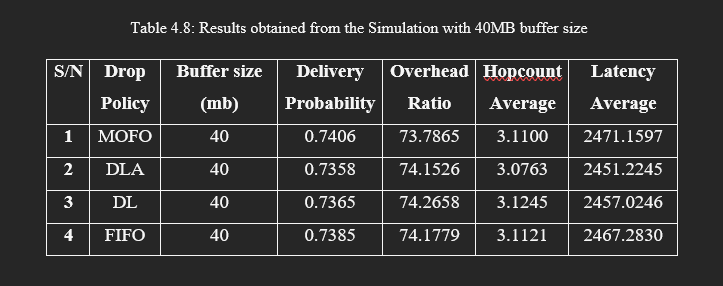

## Conclusion

Based on the simulation results, we can draw the following conclusions:

1. **Buffer Size Impact**: Increasing buffer size significantly improves performance across all metrics except latency, which shows a more complex pattern.

2. **Delivery Probability**: All four buffer management techniques show similar performance with slight variations. At the largest buffer size (40MB), MOFO slightly outperforms the others with a delivery probability of 0.7406.

3. **Overhead Ratio**: All techniques show decreasing overhead ratio as buffer size increases. At 40MB, MOFO achieves the lowest overhead ratio (73.7865).

4. **Hop Count Average**: All techniques show decreasing hop count average as buffer size increases. At 40MB, DLA achieves the lowest hop count average (3.0763).

5. **Latency Average**: Unlike other metrics, latency average initially increases with buffer size up to about 20MB and then begins to decrease. At 40MB, DLA achieves the lowest latency average (2451.2245).

6. **Overall Performance**: While all techniques perform similarly, MOFO slightly outperforms the others in terms of delivery probability and overhead ratio, while DLA performs better in terms of hop count average and latency average at larger buffer sizes.

## Conclusion

The research demonstrates that buffer management techniques have a significant impact on network performance in DTNs. The choice of buffer management technique should be based on the specific requirements and constraints of the network.

In general, MOFO slightly outperforms the other techniques across most metrics, but all techniques show improved performance with increasing buffer size.